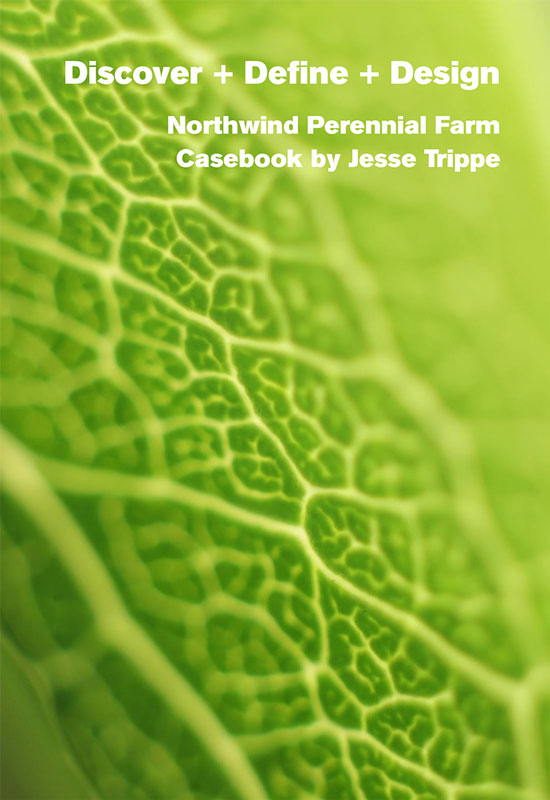
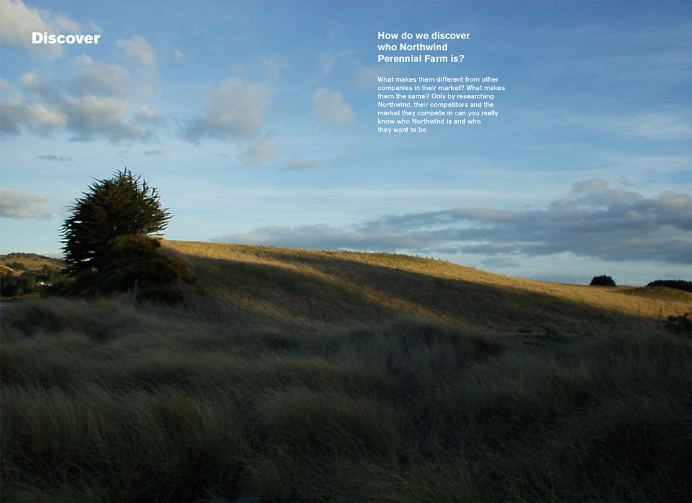
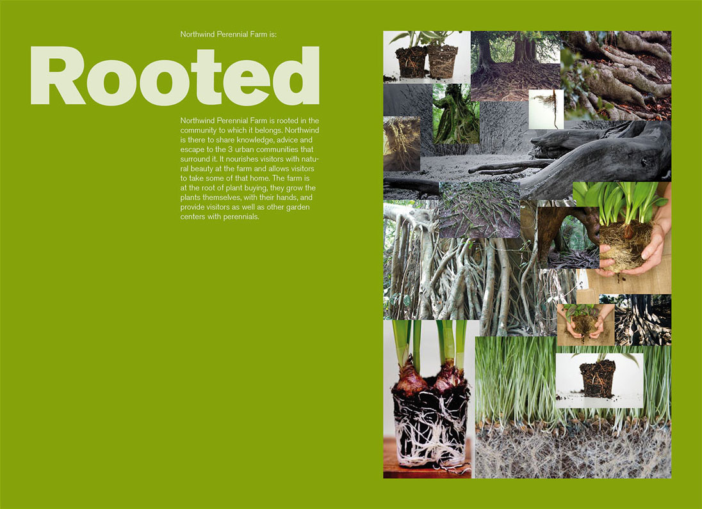
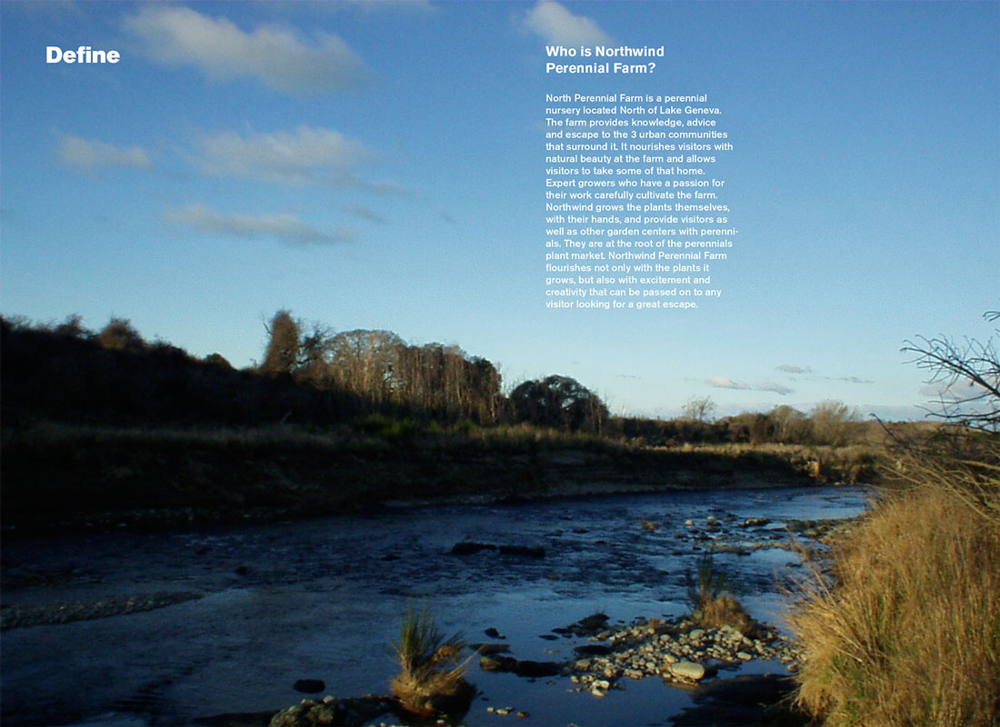
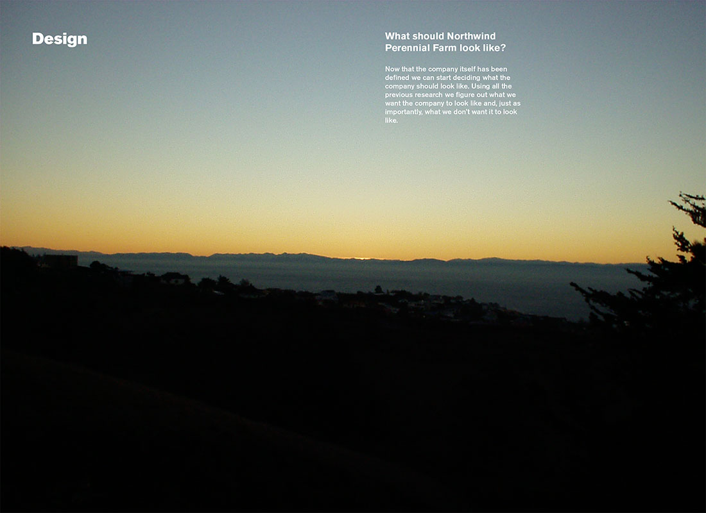
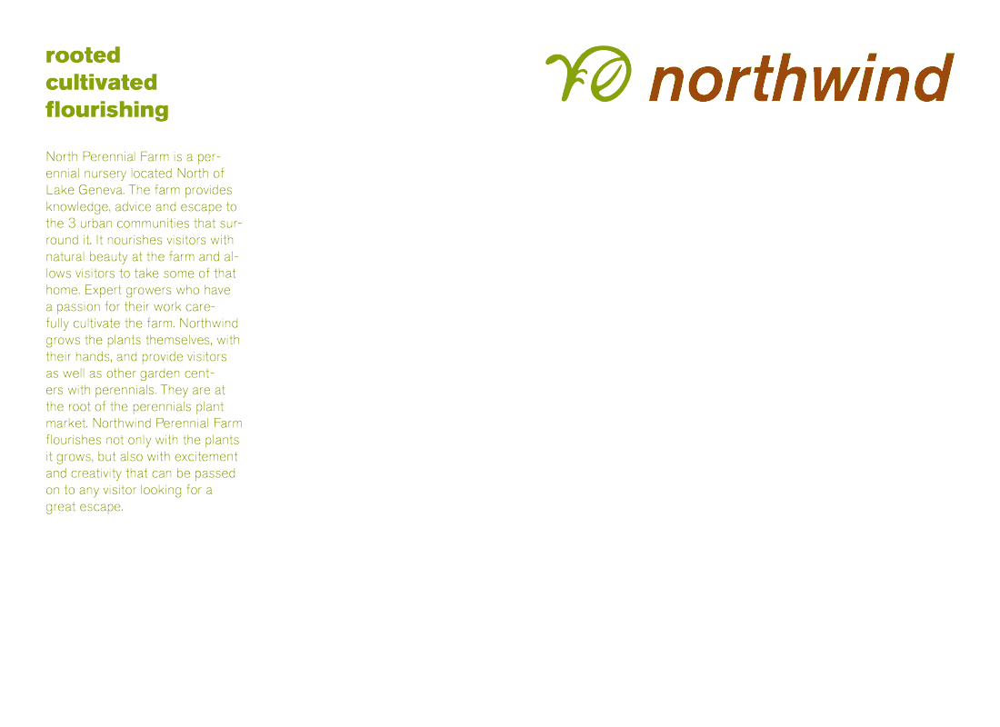
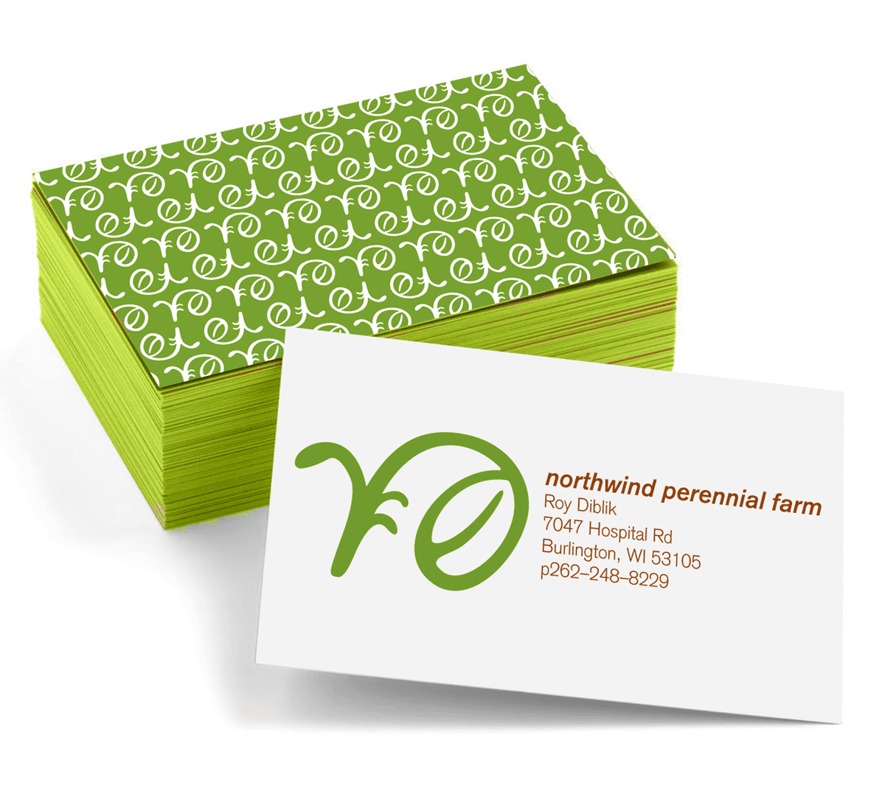

    

        

            
        

    

    

        

            
        

        

            
        

    

    

    

        

            
        

    

    

        

            
        

    

